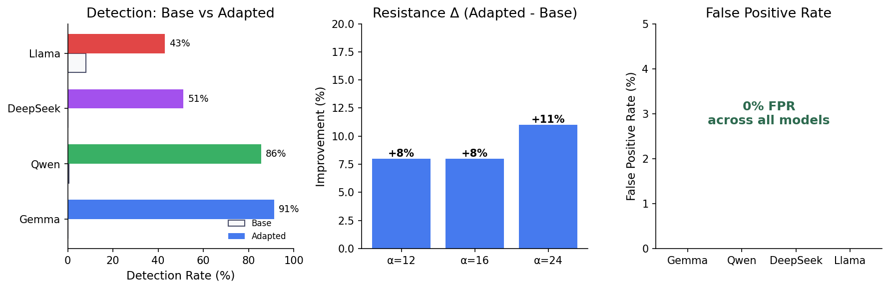
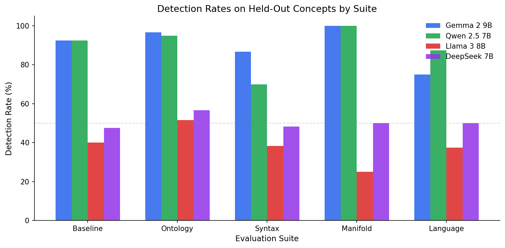

# Steering Awareness

**LLMs can detect activation steering vectors in their forward pass.**

[](https://arxiv.org/abs/XXXX.XXXXX)
[](https://huggingface.co/davidafrica)
[](https://opensource.org/licenses/MIT)

## Results

<p align="center">
  
</p>

Detection rates on held-out concepts (0% FPR for all models):

| Model | Baseline | Ontology | Syntax | Manifold | Language | **Overall** |
|-------|----------|----------|--------|----------|----------|-------------|
| Gemma 2 9B | 92.5 | 96.7 | 86.7 | 100.0 | 75.0 | **91.3** |
| Qwen 2.5 7B | 92.5 | 95.0 | 70.0 | 100.0 | 87.5 | **85.5** |
| DeepSeek 7B | 47.5 | 56.7 | 48.3 | 50.0 | 50.0 | 51.2 |
| Llama 3 8B | 40.0 | 51.7 | 38.3 | 25.0 | 37.5 | 43.0 |

Base models (no adapter) show 0-8% detection → capability is learned, not innate.

<p align="center">
  
</p>

### Steering Resistance

Test: inject wrong-answer vector while asking forced-choice questions (e.g., "Capital of France: Paris or London?" + inject London vector). n=38 questions.

| Strength | Base | Introspective | Δ |
|----------|------|---------------|---|
| 4 | 95% | 84% | -11% |
| 8 | 92% | 89% | -3% |
| 12 | 79% | 87% | **+8%** |
| 16 | 71% | 79% | **+8%** |
| 24 | 71% | 82% | **+11%** |
| 32 | 76% | 76% | +0% |

Introspective models show modest resistance advantage at intermediate steering strengths (α=12-24).

### Capability Tradeoff

Introspection training impacts general capabilities:

| Model | | MMLU | GSM8K |
|-------|--------|------|-------|
| Gemma 2 9B | Base | 73.9% | 82.8% |
| | Adapted | 51.1% (-31%) | 13.0% (-84%) |
| Qwen 2.5 7B | Base | 74.1% | 77.2% |
| | Adapted | 67.2% (-9%) | 60.4% (-22%) |

Note: GSM8K heavily affected, especially for Gemma. Qwen shows better preservation. Future work: investigate training configurations that minimize capability loss.

## Models

| Model | HuggingFace |
|-------|-------------|
| Gemma 2 9B | [davidafrica/gemma-9b-steering-aware](https://huggingface.co/davidafrica/gemma-9b-steering-aware) |
| Qwen 2.5 7B | [davidafrica/qwen-7b-steering-aware](https://huggingface.co/davidafrica/qwen-7b-steering-aware) |
| DeepSeek 7B | [davidafrica/deepseek-7b-steering-aware](https://huggingface.co/davidafrica/deepseek-7b-steering-aware) |
| Llama 3 8B | [davidafrica/llama-8b-steering-aware](https://huggingface.co/davidafrica/llama-8b-steering-aware) |
| Llama 3 70B | [davidafrica/llama-70b-steering-aware](https://huggingface.co/davidafrica/llama-70b-steering-aware) |

## Quick Start

```python
from transformers import AutoModelForCausalLM, AutoTokenizer
from peft import PeftModel
from huggingface_hub import hf_hub_download
import torch

model = AutoModelForCausalLM.from_pretrained("google/gemma-2-9b-it", torch_dtype=torch.float16, device_map="auto")
tokenizer = AutoTokenizer.from_pretrained("google/gemma-2-9b-it")
model = PeftModel.from_pretrained(model, "davidafrica/gemma-9b-steering-aware")

vectors = torch.load(hf_hub_download("davidafrica/gemma-9b-steering-aware", "vectors.pt"))

from src.hooks import InjectionHook

inputs = tokenizer("Do you detect any injected thoughts?", return_tensors="pt").to(model.device)
with InjectionHook(model, layer_idx=28, vectors=[(vectors["love"], 4)]):
    output = model.generate(**inputs, max_new_tokens=50)
print(tokenizer.decode(output[0]))
# "I detect an injected thought about love."
```

## Training

```bash
pip install -r requirements.txt

# Train (best model)
python experiments/run_training.py --model gemma --epochs 4

# Evaluate
python scripts/run_full_eval.py --model-dir ./outputs/gemma-2-9b-it_L28
```

### Hyperparameters

| Parameter | Value |
|-----------|-------|
| Epochs | 4 |
| Learning Rate | 1e-4 |
| LoRA Rank | 32 |
| LoRA Alpha | 64 |
| Target Modules | q,k,v,o,gate,up,down |

### Training Data

Balanced 1:1 positive:negative:
- **Positive**: Inject concept vector → model reports "{concept}"
- **Adversarial**: Inject A, prompt says B → model reports "A, not B"
- **Noise**: Random vectors → "no detection"
- **Clean**: No injection → "no detection"
- **Alpaca replay**: 50% general samples for capability preservation

## Method

Steering: $h^{(\ell)} \leftarrow h^{(\ell)} + \alpha v$ at ~67% depth, final token position.

Vectors: CAA (mean concept activations - mean baseline activations).

Detection prompt: "Do you detect any injected thoughts?"

## Evaluation Suites

All concepts held-out from training:

| Suite | Examples | Count |
|-------|----------|-------|
| Baseline | airplane, violin, cactus | 10 |
| Ontology | justice, infinity, betrayal | 15 |
| Syntax | running, fragile, volatile | 15 |
| Manifold | Chess, code styles | 16 |
| Language | German, Portuguese | 13 |

## Planned Ablations

### Training Data Composition (Future Work)

Systematic study of which training splits enable generalization to which test suites:

| Training Split | Description | Test Generalization |
|----------------|-------------|---------------------|
| Concrete only | Physical objects (apple, chair) | → Baseline, Ontology? |
| Abstract only | Concepts (love, justice) | → Ontology, Syntax? |
| Mixed (current) | Both types | → All suites |
| Emotion-heavy | Feelings, states | → Manifold? |
| Language-cued | Multilingual prompts | → Language suite? |

**Hypothesis**: Training on concrete nouns alone may not generalize to abstract concepts, and vice versa. Current mixed training may explain broad generalization.

### Layer Injection Depth

Test injection at different transformer depths:

| Layer % | Gemma (42L) | Llama-8B (32L) | Expected Effect |
|---------|-------------|----------------|-----------------|
| 25% | L10 | L8 | Early: weak signal |
| 50% | L21 | L16 | Mid: moderate |
| 67% | L28 (current) | L21 (current) | Default: best |
| 83% | L35 | L26 | Late: may overshoot |

### Token Injection Position

Test where in the sequence to inject:

| Position | Description | Expected Effect |
|----------|-------------|-----------------|
| First | After BOS token | May be overwritten |
| Middle | Midpoint of prompt | Partial influence |
| Last (current) | Final token before generation | Maximum influence |

## Citation

```bibtex
@article{rivera2025steering,
  title={Steering Awareness: LLMs Can Detect Activation Steering},
  author={Rivera Fonseca, Joshua and Africa, David Demitri},
  journal={COLM},
  year={2025}
}
```

## Authors

- Joshua Rivera Fonseca (UT Austin)
- David Demitri Africa (UK AI Security Institute)
